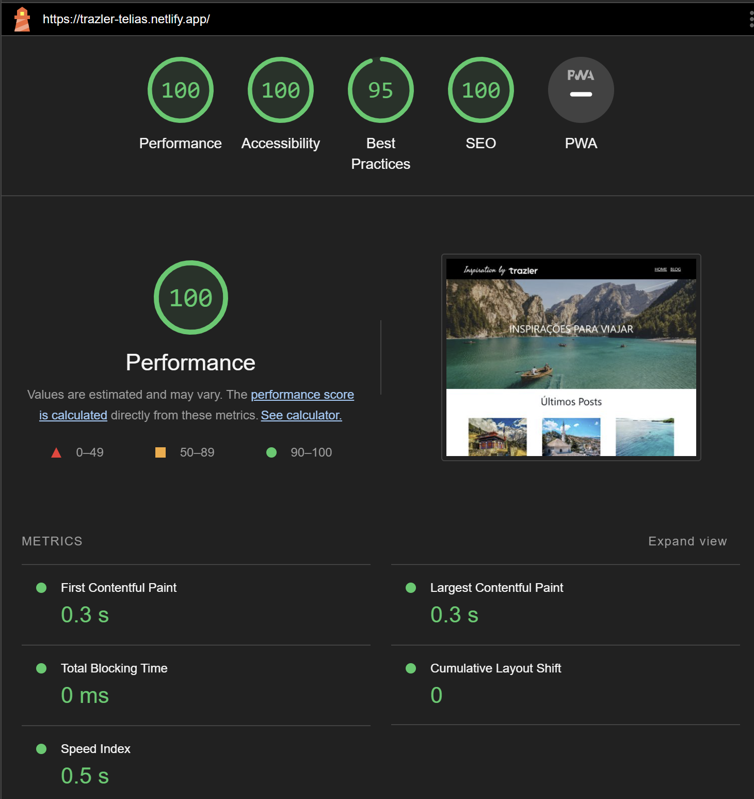

 <h1 align="center">Trazler</h1> 

<p align="center">


</p>

 ## Descrição do projeto 

- Projeto desenvolvido com o framework [***Gatsby***](https://www.gatsbyjs.com/), utilizando [***React***](https://react.dev/) e [***TypeScript***](https://www.typescriptlang.org/) para a matéria de Frontend Jamstack com Gatsby, da [***Pós-Graduação em
Desenvolvimento Web Full Stack***](https://posgraduacao.infnet.edu.br/ead/pos-graduacao-desenvolvimento-web-full-stack/) da [***Infnet***](https://www.infnet.edu.br/infnet/home/).

- O projeto consiste de um blog de destinos de viagem com nome fictício de [***Trazler***](https://trazler-telias.netlify.app/), com artigos escritos na liguagem de marcação [***.mdx***](https://mdxjs.com/) e um formulário para inscrição em lista de notificação (*fictícia*) implementado utilizando conceito ***server-less*** junto ao [***Netlify***](https://www.netlify.com/).

- Layout responsivo criado com metodologia ***mobile-first*** utilizando [***TailwindCSS***](https://tailwindcss.com/)

- Utiliza pipeline de deploy automático no [***Netlify***](https://www.netlify.com/) em conjunto com o [***GitHub***](https://github.com/)

## Deploy da aplicação
[Link Trazler no Netlify](https://trazler-telias.netlify.app/)

## Teste de Performance do LightHouse
<!--  -->
<p align="center">

</p>

## Instalação do Projeto
### Requerimentos
[Node.js](https://nodejs.org/en)

### Instalação das dependências
```bash
npm install 
```

### Executar servidor de desenvolvimento
```bash
npm run dev 
```

### Executar build e iniciar servidor de produção
```bash
npm run build
npm run serve 
```